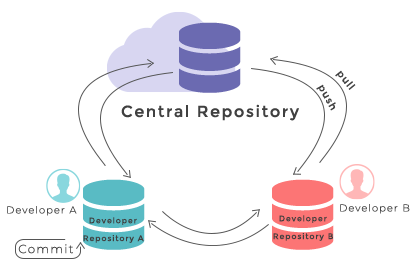

[<к содержанию>](readme.md)

# Работа с удалённым репозиторием



Для того чтобы внести вклад в какой-либо проект, вам требуется работать с удалёнными репозиториями. Удалённые репозитории это версии вашего IT-проекта, сохраненные в сети (локальной или интернет). При совместной работе над проектом предполагается внесение изменений в удаленный репозиторий.

**git remote add [имя_удаленного_репозитория] [адрес]** используется для добавления связанных удаленных репозиториев.

Например:

```php=
git remote add origin https://github.com/avsudnichnikov/example
```
**git fetch** используется для получения изменений с удаленного репозитория. При этом приходит список изменений, но они не вносятся в код, используемый в локальном репозитории.

**git merge** используется для слияния полученных изменений и локального репозитория.

**git pull** является объединением двух последовательных команд `git fetch` и `git merge`.

**git push** производит отправку ваших изменений в репозиторий. Если вы и другой разработчик одновременно клонируете, затем он выполняет команду push, то, если после него вы попытаетесь выполнить команду push, ваш push точно будет отклонён. Для внесения ваших изменений вам требуется получить изменения с удалённого репозитория и слить их с вашим программным кодом.

## Получение данных о состоянии репозитория

**git status** позволяет отследить состояние репозитория. Позволяет узнать, какие изменения необходимо зарегистрировать Git (при необходимости — отменить).

**git log** покажет список последних коммитов и их хеши SHA1. Список выводится начиная с последнего коммита.

**git show [хэш]** показывает информацию по определённому коммиту.